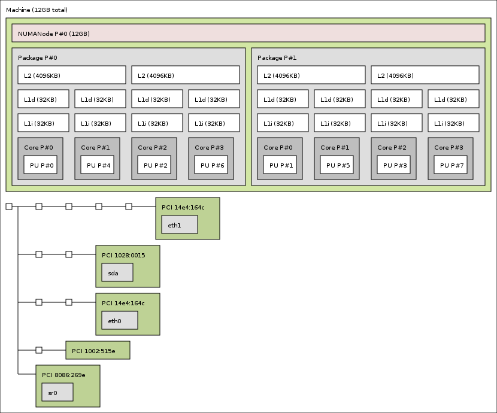
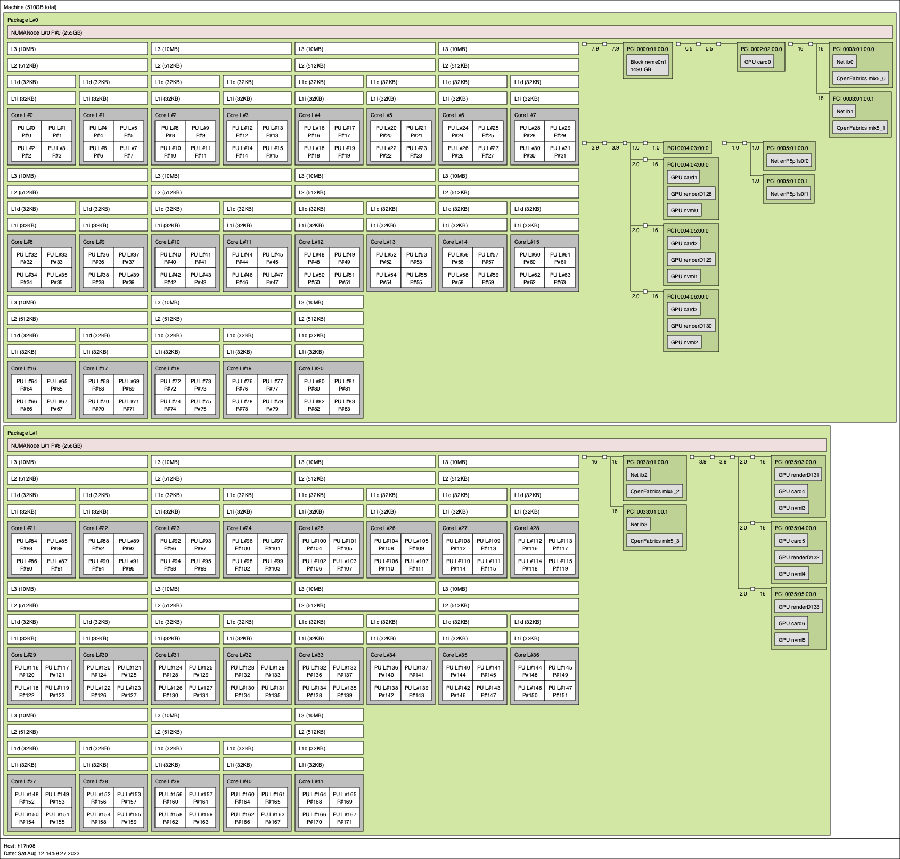

Distance Computation
====================

For performance purposes, users would prefer that their application processes utilize devices (e.g., fabric interfaces and GPUs) that are "close" to the location where each process is bound. The term "close" here is defined in terms of communication delay - i.e., the time required for a byte of data to be transferred between the process and the device. As the question relates solely to the selection of one device from several candidates, it is only the relative distance that matters. Thus, the application and/or user simply seeks to know (for example) if a given device is twice as far away as another similar device so that it can choose to user the latter.

Here is a pic of one topology:

Another topology:

.. image:: ../images/amd-gpus.jpg
    :width: 600
    :alt: Image of AMD package with GPUs topology

