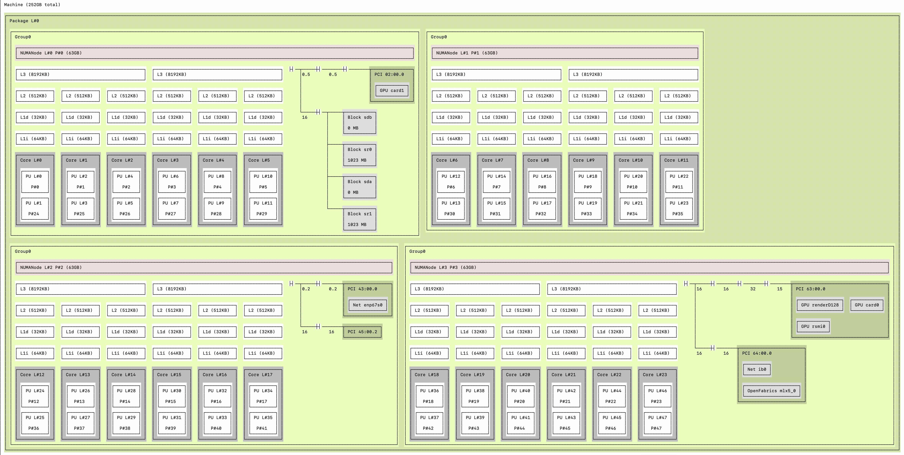

Distance Computation
====================

For performance purposes, users would prefer that their application processes utilize devices (e.g., fabric interfaces and GPUs) that are "close" to the location where each process is bound. The term "close" here is defined in terms of communication delay - i.e., the time required for a byte of data to be transferred between the process and the device. As the question relates solely to the selection of one device from several candidates, it is only the relative distance that matters. Thus, the application and/or user simply seeks to know (for example) if a given device is twice as far away as another similar device so that it can choose to user the latter.

Here is a pic of one topology:

Another topology:

NOTE: any potential security issue should be reported immediately to us at security@pmix.org

Vulnerability Disclosure Process
--------------------------------

Software Authenticity and Integrity
-----------------------------------
Authenticity and integrity of PMIx software should always be confirmed by computing the checksum of the archive and comparing it with the value listed on the GitHub release page. Assuming you downloaded the file pmix-4.2.2.tar.bz2, you can run the ``sha1sum`` command like this:

.. code-block:: sh

    shell$ sha1sum pmix-4.2.2.tar.bz2

Check that the output matches what is printed in the release announcement, which may look like this:

.. code-block:: sh

    b4e1cb79dfd94c1b9db8eaba02f725c07ef9df2b  pmix-4.2.2.tar.bz2

To avoid having to manually compare the string, you may use the ``sha1sum -c parameter`` as follows:

.. code-block:: sh

    echo 'b4e1cb79dfd94c1b9db8eaba02f725c07ef9df2b  pmix-4.2.2.tar.bz2'|sha1sum -c

