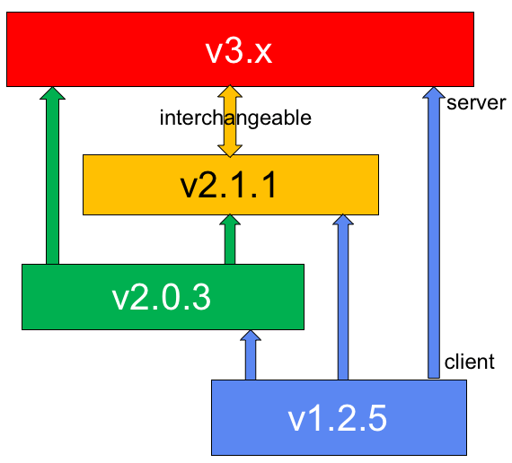

.. _label-version-numbers:

Version Numbers and Binary Compatibility
========================================

OpenPMIx has two sets of version numbers that are likely of interest
to end users / system administrator:

* Software version number
* Shared library version numbers

Both are described below, followed by a discussion of application
binary interface (ABI) compatibility implications.

Software Version Number
-----------------------

OpenPMIx's version numbers are the union of several different values:
major, minor, release, and an optional quantifier.

* Major: The major number is the first integer in the version string
  (e.g., v1.2.3). Changes in the major number typically indicate a
  significant change in the code base and/or end-user
  functionality. The major number is always included in the version
  number.

* Minor: The minor number is the second integer in the version
  string (e.g., v1.2.3). Changes in the minor number typically
  indicate a incremental change in the code base and/or end-user
  functionality. The minor number is always included in the version
  number:

* Release: The release number is the third integer in the version
  string (e.g., v1.2.3). Changes in the release number typically
  indicate a bug fix in the code base and/or end-user
  functionality.

* Quantifier: OpenPMIx version numbers sometimes have an arbitrary
  string affixed to the end of the version number. Common strings
  include:

  * ``aX``: Indicates an alpha release. X is an integer indicating
    the number of the alpha release (e.g., v1.2.3a5 indicates the
    5th alpha release of version 1.2.3).
  * ``bX``: Indicates a beta release. X is an integer indicating
    the number of the beta release (e.g., v1.2.3b3 indicates the 3rd
    beta release of version 1.2.3).
  * ``rcX``: Indicates a release candidate. X is an integer
    indicating the number of the release candidate (e.g., v1.2.3rc4
    indicates the 4th release candidate of version 1.2.3).

Although the major, minor, and release values (and optional
quantifiers) are reported in OpenPMIx nightly snapshot tarballs, the
filenames of these snapshot tarballs follow a slightly different
convention.

Specifically, the snapshot tarball filename contains three distinct
values:

* Most recent Git tag name on the branch from which the tarball was
  created.

* An integer indicating how many Git commits have occurred since
  that Git tag.

* The Git hash of the tip of the branch.

For example, a snapshot tarball filename of
``pmix-v1.0.2-57-gb9f1fd9.tar.bz2`` indicates that this tarball was
created from the v1.0 branch, 57 Git commits after the ``v1.0.2`` tag,
specifically at Git hash gb9f1fd9.

OpenPMIx's Git master branch contains a single ``dev`` tag.  For example,
``pmix-dev-8-gf21c349.tar.bz2`` represents a snapshot tarball created
from the master branch, 8 Git commits after the "dev" tag,
specifically at Git hash gf21c349.

The exact value of the "number of Git commits past a tag" integer is
fairly meaningless; its sole purpose is to provide an easy,
human-recognizable ordering for snapshot tarballs.

Shared Library Version Number
-----------------------------

OpenPMIx uses the GNU Libtool shared library versioning scheme.

.. note:: Only official releases of OpenPMIx adhere to this versioning
          scheme. "Beta" releases, release candidates, and nightly
          tarballs, developer snapshots, and Git snapshot tarballs
          likely will all have arbitrary/meaningless shared library
          version numbers.

The GNU Libtool official documentation details how the versioning
scheme works.  The quick version is that the shared library versions
are a triple of integers: (current,revision,age), or ``c:r:a``.  This
triple is not related to the PMIx software version number.  There
are six simple rules for updating the values (taken almost verbatim
from the Libtool docs):

#. Start with version information of ``0:0:0`` for each shared library.

#. Update the version information only immediately before a public
   release of your software. More frequent updates are unnecessary,
   and only guarantee that the current interface number gets larger
   faster.

#. If the library source code has changed at all since the last
   update, then increment revision (``c:r:a`` becomes ``c:r+1:a``).

#. If any interfaces have been added, removed, or changed since the
   last update, increment current, and set revision to 0.

#. If any interfaces have been added since the last public release,
   then increment age.

#. If any interfaces have been removed since the last public release,
   then set age to 0.

Application Binary Interface (ABI) Compatibility
------------------------------------------------

OpenPMIx provides forward ABI compatibility in all versions of a given
feature release series and its corresponding
super stable series.  For example, on a single platform, a PMIx
application linked against OpenPMIx v1.3.2 shared libraries can be
updated to point to the shared libraries in any successive v1.3.x or
v1.4 release and still work properly (e.g., via the ``LD_LIBRARY_PATH``
environment variable or other operating system mechanism).

OpenPMIx reserves the right to break ABI compatibility at new feature
release series.  For example, the same PMIx application from above
(linked against PMIx v1.3.2 shared libraries) will *not* work with
PMIx v1.5 shared libraries.

Cross-Version Compatibility
---------------------------

As PMIx adoption has grown, the problem of managing application-SMS interactions between different PMIx library versions has increased in visibility. It soon became clear that use of a common library version by both SMS and application could not be guaranteed, especially in the container-based application use-case. Thus, cross-version compatibility arose as a problem.

PMIx has addressed this by utilizing a plugin-based architecture that allows both the client and server to select from a range of supported protocol levels. The resulting coordination is based on a client-driven handshake – i.e., the client selects the protocol to be used, and the server adapts to support it. The client’s selection is based on a combination of environmental parameters passed to it at launch by the server, filtered against the protocols available to that particular client. For example, a PMIx v1.2 client only has the ``usock`` messaging transport available to it, and so would select that transport even when a PMIx v3 server offered ``usock`` and ``tcp`` options. Note that if the PMIx v3 server had not been instructed to support ``usock``, then the v1.2 client would have failed ``PMIx_Init`` with an error indicating the server was unreachable.

Although the PMIx community is committed to supporting the cross-version use-case, early releases did not fully provide the necessary capabilities. Each release branch has since been updated to include the required translation logic for communicating to other versions, but full compatibility could not be provided due to the level of changes it would introduce to what would otherwise be considered a ``stable`` release series. Thus, the following chart shows the available compatibility:

Starting with v2.1.1, all versions are fully cross-compatible – i.e., the client and server versions can be any combination of release level. Thus, a v2.1.1 client can connect to a v3.0.0 server, and vice versa.

PMIx v1.2.5 servers can only serve v1.2.x clients, but v1.2.5 clients can connect to v2.0.3, and v2.1.1 or higher servers. Similarly, v2.0.3 servers can only serve v2.0.x and v1.2.5 clients, but v2.0.3 clients can connect to v2.1.1 or higher servers.

.. note:: The cross-version guarantee only means that users of two different versions will be able to communicate requests and their responses. It does not guarantee that both sides will completely support the requests. It is possible, for example, for a server to not include support for an operation that was introduced in a newer version being used by a client. Likewise, it is possible that a bug existed in an earlier version that precludes correct completion of the request.
